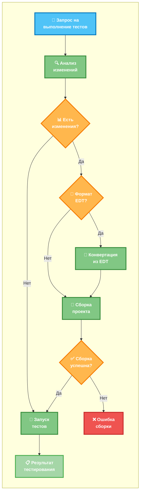

# METR - <span style="color: red">M</span>CP 1C:<span style="color: red">E</span>nterprise <span style="color: red">T</span>est <span style="color: red">R</span>unner

[](https://github.com/alkoleft/mcp-onec-test-runner/releases)
[](https://github.com/alkoleft/mcp-onec-test-runner/releases)
[](https://www.gnu.org/licenses/gpl-3.0)
[](https://github.com/alkoleft/mcp-onec-test-runner/issues)
[](https://github.com/alkoleft/mcp-onec-test-runner/pulls)
[](https://github.com/alkoleft/mcp-onec-test-runner/commits/master)
[](https://github.com/alkoleft/mcp-onec-test-runner/stargazers)

[](https://github.com/alkoleft/mcp-onec-test-runner)


[](https://github.com/1C-Company/1c-edt-issues/issues/1758)

Инструмент, который позволяет запускать тесты YaXUnit и собирать проекты 1С прямо из AI‑ассистентов (Claude, GPT, Cursor, VS Code и др.) с помощью протокола MCP (Model Context Protocol).

## Описание

MCP 1C:Enterprise Test Runner — это MCP‑сервер, который подключается к вашему проекту 1С:Предприятие и предоставляет ассистенту команды для сборки и запуска тестов YaXUnit.

## Быстрый старт

1. Проверьте [технические требования](#технические-требования)
2. Скачайте **jar** файл со страницы [последнего релиза](https://github.com/alkoleft/mcp-onec-test-runner/releases)
3. Подготовьте [конфигурацию приложения](docs/APPLICATION_CONFIGURATION.md).
4. [Подключите](docs/IDE_SETUP.md) MCP‑сервер

## Основные возможности

- Запуск всех тестов проекта
- Выполнение тестов отдельных модулей
- Сборка проекта 1С
- Быстрая конвертация из формата EDT за счёт автозапуска EDT CLI в интерактивном режиме



> Примечание: при формате проекта `EDT` и включённом автозапуске (`app.tools.edt-cli.auto-start: true`) EDT CLI поднимается заранее в интерактивном режиме. Это сокращает время на инициализацию и ускоряет шаг «Конвертация из EDT».

## Технические требования

> **Важно для пользователей EDT:** Ознакомьтесь с [известными проблемами EDT](docs/EDT_KNOWN_ISSUES.md) и рекомендациями по их решению.


- JDK 17+
- Платформа 1С:Предприятие 8.3.10+
- YaXUnit фреймворк
- 1С:Enterprise Development Tools 2025.1+ (для формата EDT; см. [Issue #1758](https://github.com/1C-Company/1c-edt-issues/issues/1758))

## Запуск MCP-сервера

```bash
java -jar mcp-yaxunit-runner.jar
```

## Настройка MCP

### Предварительные требования

1. **Соберите проект** и создайте JAR-файл
2. **Убедитесь, что JAR-файл доступен** для запуска
3. **Создайте файл конфигурации** для вашего проекта

### Создание файла конфигурации

Перед настройкой MCP сервера создайте файл конфигурации для вашего проекта. Файл `src/main/resources/application-yaxunit.yml` является примером — скопируйте его и настройте под свои нужды.

Полный пошаговый гид по настройке: [Application Configuration](docs/APPLICATION_CONFIGURATION.md).

#### Основные параметры для настройки:

- **`app.base-path`** - базовый путь к вашему проекту
- **`app.source-set`** - описание модулей проекта (пути, типы, назначение)
- **`app.connection.connection-string`** - строка подключения к информационной базе
- **`app.format`** - формат проекта (`DESIGNER` | `EDT`)
- **`app.platform-version`** - версия платформы 1С (опционально)
- **`app.tools.builder`** - тип сборщика (`DESIGNER` | `IBMCMD`)
- **`app.tools.edt-cli`** - опции EDT CLI (опционально, при `app.format: EDT`)

##### Схема настроек (кратко)

```yaml
app:
  id: string?                    # опционально
  format: DESIGNER|EDT           # по умолчанию DESIGNER
  base-path: string              # абсолютный путь
  source-set:                    # >=1 элемент с type: CONFIGURATION
    - path: string               # относительный путь от base-path
      name: string               # уникальное имя
      type: CONFIGURATION|EXTENSION
      purpose: [ MAIN | TESTS | YAXUNIT ]
  connection:
    connection-string: string    # обязателен
    user: string?                # опционально
    password: string?            # опционально
  tools:
    builder: DESIGNER|IBMCMD     # обязателен
    edt-cli:                     # опционально; требуется 1C:EDT >= 2025.1
      auto-start: boolean        # default: false
      version: string            # default: "latest"
      interactive-mode: boolean  # default: true
      working-directory: string? # EDT workspace
      startup-timeout-ms: number # default: 30000
      command-timeout-ms: number # default: 300000
      ready-check-timeout-ms: number # default: 5000
  platform-version: string?      # формат x[.x]+, напр. 8.3.22.1709
```

#### Настройка исходников

Для корректной работы с тестами YaXUnit обязательно настройте в `source-set`:

```yaml
source-set:
  # Основная конфигурация (обязательно)
  - path: "configuration"
    name: your-config-name
    type: "CONFIGURATION"
    purpose: [ "MAIN" ]
  
  # Модуль с тестами
  - path: "tests"
    name: tests
    type: "EXTENSION"
    purpose: [ "TESTS", "YAXUNIT" ]
```

#### Пример структуры

```yaml
app:
  id: your-project-name
  base-path: "/path/to/your/project/"
  source-set:
    - path: "configuration"
      name: your-config
      type: "CONFIGURATION"
      purpose: ["MAIN"]
  connection:
    connection-string: "File='/path/to/your/infobase/';"
  platform-version: "8.3.24.1234"
  tools:
    builder: DESIGNER
```

### Настройка MCP сервера

Подробная инструкция по настройке MCP сервера для различных IDE и AI-ассистентов: **[Настройка IDE (IDE Setup)](docs/IDE_SETUP.md)**

Включает:
- Настройку для Claude Desktop
- Настройку для VS Code
- Поддержку других MCP-совместимых клиентов (Cursor, Continue, Cody)
- Проверку настройки и устранение неполадок
- Переменные окружения
- Примеры использования

## Доступные MCP-инструменты

- `yaxunit_run_all_tests` - запуск всех тестов
- `yaxunit_run_module_tests` - запуск тестов модуля
- `yaxunit_build_project` - сборка проекта
- `yaxunit_list_modules` - получение списка модулей
- `yaxunit_get_configuration` - получение конфигурации
- `yaxunit_check_platform` - проверка платформы

## Дорожная карта разработки 🚀

- [ ] 🔄 Поддержка EDT + умная конвертация
  - [x] **Интеграция с EDT (Enterprise Development Tools)**
  - [ ] **Умная конвертация модулей** - при изменении модуля автоматическое копирование и обновление
  - [ ] **Автоматическое определение изменений** в исходном коде

- [ ] 🖥️ Поддержка IBMCMD
  - **Интеграция с IBMCMD** для автоматизации сборки

- [ ] 🌐 Запуск тестов через WebSocket
  - **Быстрое выполнение** тестов

## Разработка

### Подготовка к разработке

1. **Создайте форк репозитория** на GitHub
2. **Клонируйте репозиторий**:

   ```bash
   git clone https://github.com/YOUR_USERNAME/mcp-onec-test-runner.git
   cd mcp-onec-test-runner
   ```

3. **Добавьте upstream репозиторий**:

   ```bash
   git remote add upstream https://github.com/alkoleft/mcp-onec-test-runner.git
   ```

### Сборка проекта

```bash
./gradlew build
```

### Создание исполняемого JAR

```bash
./gradlew bootJar
```

### Запуск тестов

```bash
./gradlew test
```

### Анализ покрытия кода

```bash
./gradlew jacocoTestReport
```

### Проверка стиля кода

```bash
./gradlew ktlintCheck
```

## Документация

- [Application Configuration](docs/APPLICATION_CONFIGURATION.md) — подробный пошаговый гид по настройке `application.yml`
- [IDE Setup](docs/IDE_SETUP.md) — подробная инструкция по настройке MCP сервера в различных IDE и AI-ассистентах

## Лицензия

GPL-3.0 License