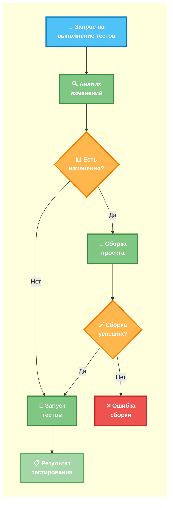

# MCP YaXUnit Runner

Инструмент для выполнения тестов YaXUnit через протокол MCP (Model Context Protocol). Предоставляет набор инструментов для тестирования проектов 1С:Предприятие через AI-ассистенты.

## Описание

Проект представляет собой MCP-сервер, который интегрируется с AI-моделями (Claude, GPT) для автоматизации тестирования проектов 1С:Предприятие с использованием фреймворка YaXUnit.


  
## Основные возможности

- Запуск всех тестов проекта
- Выполнение тестов отдельных модулей
- Сборка проекта 1С
- Получение списка доступных модулей
- Проверка статуса платформы 1С
- Получение конфигурации проекта

## Технические требования

- JDK 17+
- Gradle 8.5+
- Платформа 1С:Предприятие 8.3.24+
- YaXUnit фреймворк

## Установка и сборка

### Сборка проекта
```bash
./gradlew build
```

### Создание исполняемого JAR
```bash
./gradlew bootJar
```

## Конфигурация

### Переменные окружения
- `YAXUNIT_TESTS_PATH` - путь к директории с тестами
- `YAXUNIT_BUILD_TIMEOUT` - таймаут сборки (мс)
- `YAXUNIT_TEST_TIMEOUT` - таймаут выполнения тестов (мс)


## Запуск

### Как MCP-сервер
```bash
java -jar mcp-yaxunit-runner.jar mcp
```

### Как CLI-приложение
```bash
java -jar mcp-yaxunit-runner.jar test run-all
```

## Интеграция с AI-ассистентами

### Claude Desktop
Добавьте конфигурацию в файл `claude_desktop_config.json`:

```json
{
  "mcpServers": {
    "yaxunit-runner": {
      "command": "java",
      "args": ["-jar", "/path/to/mcp-yaxunit-runner.jar", "--spring.profiles.active=mcp"],
      "env": {
        "YAXUNIT_TESTS_PATH": "./tests"
      }
    }
  }
}
```

## Доступные MCP-инструменты

- `yaxunit_run_all_tests` - запуск всех тестов
- `yaxunit_run_module_tests` - запуск тестов модуля
- `yaxunit_run_list_tests` - запуск тестов списка модулей
- `yaxunit_build_project` - сборка проекта
- `yaxunit_list_modules` - получение списка модулей
- `yaxunit_get_configuration` - получение конфигурации
- `yaxunit_check_platform` - проверка платформы

## Разработка

### Запуск тестов
```bash
./gradlew test
```

### Анализ покрытия кода
```bash
./gradlew jacocoTestReport
```

### Проверка стиля кода
```bash
./gradlew ktlintCheck
```

## Документация

- [MCP Integration Guide](MCP_INTEGRATION.md) - подробное руководство по интеграции
- [YaXUnit Integration](docs/YAXUNIT_INTEGRATION.md) - интеграция с YaXUnit

## Лицензия

MIT License 