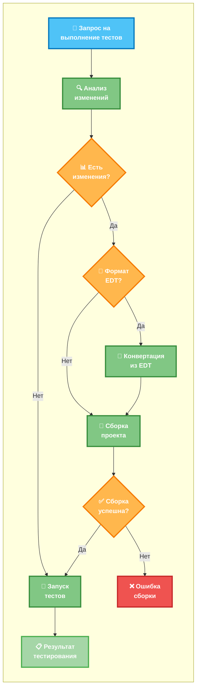

# MCP YaXUnit Runner

[](https://github.com/alkoleft/mcp-onec-test-runner/releases)
[](https://github.com/alkoleft/mcp-onec-test-runner/releases)
[](https://github.com/alkoleft/mcp-onec-test-runner/blob/master/LICENSE)
[](https://github.com/alkoleft/mcp-onec-test-runner/stargazers)
[](https://github.com/alkoleft/mcp-onec-test-runner/issues)
[](https://github.com/alkoleft/mcp-onec-test-runner/pulls)
[](https://github.com/alkoleft/mcp-onec-test-runner/commits/master)
[](https://github.com/alkoleft/mcp-onec-test-runner)


[](https://github.com/1C-Company/1c-edt-issues/issues/1758)


Инструмент, который позволяет запускать тесты YaXUnit и собирать проекты 1С прямо из AI‑ассистентов (Claude, GPT, Cursor, VS Code и др.) с помощью протокола MCP (Model Context Protocol).

## Описание

MCP YAxUnit Runner — это MCP‑сервер, который подключается к вашему проекту 1С:Предприятие и предоставляет ассистенту команды для сборки и запуска тестов YaXUnit.
 
## Быстрый старт

1. Соберите проект:
   ```bash
   ./gradlew build
   ```
2. Подготовьте конфигурацию приложения: см. подробный гид — [Application Configuration](docs/APPLICATION_CONFIGURATION.md).
3. Запустите MCP‑сервер (пример):
   ```bash
   export SPRING_CONFIG_IMPORT=/abs/path/to/application.yml
   java -jar /path/to/mcp-yaxunit-runner.jar
   ```

## Основные возможности

- Запуск всех тестов проекта
- Выполнение тестов отдельных модулей
- Сборка проекта 1С
- Получение списка доступных модулей
- Проверка статуса платформы 1С
- Получение конфигурации проекта
- Быстрая конвертация из формата EDT за счёт автозапуска EDT CLI в интерактивном режиме



> Примечание: при формате проекта `EDT` и включённом автозапуске (`app.tools.edt-cli.auto-start: true`) EDT CLI поднимается заранее в интерактивном режиме. Это сокращает время на инициализацию и ускоряет шаг «Конвертация из EDT».

## Дорожная карта разработки 🚀

- [ ] 🔄 Поддержка EDT + умная конвертация
  - [ ] **Интеграция с EDT (Enterprise Development Tools)**
  - [ ] **Умная конвертация модулей** - при изменении модуля автоматическое копирование и обновление
  - [ ] **Автоматическое определение изменений** в исходном коде

- [ ] 🖥️ Поддержка IBMCMD
  - **Интеграция с IBMCMD** для автоматизации сборки

- [ ] 🌐 Запуск тестов через WebSocket
  - **Быстрое выполнение** тестов

## Технические требования

- JDK 17+
- Gradle 8.5+
- Платформа 1С:Предприятие 8.3.10+
- YaXUnit фреймворк
- 1С:Enterprise Development Tools 2025.1+ (для формата EDT; см. [Issue #1758](https://github.com/1C-Company/1c-edt-issues/issues/1758))

## Установка и сборка

### Сборка проекта
```bash
./gradlew build
```

### Создание исполняемого JAR
```bash
./gradlew bootJar
```

## Запуск MCP-сервера
```bash
java -jar mcp-yaxunit-runner.jar
```

## Настройка MCP

### Предварительные требования

1. **Соберите проект** и создайте JAR файл
2. **Убедитесь, что JAR файл доступен** для запуска
3. **Создайте файл конфигурации** для вашего проекта

### Создание файла конфигурации

Перед настройкой MCP сервера создайте файл конфигурации для вашего проекта. Файл `src/main/resources/application-yaxunit.yml` является примером — скопируйте его и настройте под свои нужды.

Полный пошаговый гид по настройке: [Application Configuration](docs/APPLICATION_CONFIGURATION.md).

#### Основные параметры для настройки:

- **`app.base-path`** - базовый путь к вашему проекту
- **`app.source-set`** - описание модулей проекта (пути, типы, назначение)
- **`app.connection.connection-string`** - строка подключения к информационной базе
- **`app.format`** - формат проекта (`DESIGNER` | `EDT`)
- **`app.platform-version`** - версия платформы 1С (опционально)
- **`app.tools.builder`** - тип сборщика (`DESIGNER` | `IBMCMD`)
- **`app.tools.edt-cli`** - опции EDT CLI (опционально, при `app.format: EDT`)

##### Схема настроек (кратко)

```yaml
app:
  id: string?                    # опционально
  format: DESIGNER|EDT           # по умолчанию DESIGNER
  base-path: string              # абсолютный путь
  source-set:                    # >=1 элемент с type: CONFIGURATION
    - path: string               # относительный путь от base-path
      name: string               # уникальное имя
      type: CONFIGURATION|EXTENSION
      purpose: [ MAIN | TESTS | YAXUNIT ]
  connection:
    connection-string: string    # обязателен
    user: string?                # опционально
    password: string?            # опционально
  tools:
    builder: DESIGNER|IBMCMD     # обязателен
    edt-cli:                     # опционально; требуется 1C:EDT >= 2025.1
      auto-start: boolean        # default: false
      version: string            # default: "latest"
      interactive-mode: boolean  # default: true
      working-directory: string? # EDT workspace
      startup-timeout-ms: number # default: 30000
      command-timeout-ms: number # default: 300000
      ready-check-timeout-ms: number # default: 5000
  platform-version: string?      # формат x[.x]+, напр. 8.3.22.1709
```

#### Настройка исходников тестов:

Для корректной работы с тестами YaXUnit обязательно настройте в `source-set`:

```yaml
source-set:
  # Основная конфигурация (обязательно)
  - path: "configuration"
    name: your-config-name
    type: "CONFIGURATION"
    purpose: [ "MAIN" ]
  
  # Модуль с тестами
  - path: "tests"
    name: tests
    type: "EXTENSION"
    purpose: [ "TESTS", "YAXUNIT" ]
```

#### Пример структуры:
```yaml
app:
  id: your-project-name
  base-path: "/path/to/your/project/"
  source-set:
    - path: "configuration"
      name: your-config
      type: "CONFIGURATION"
      purpose: ["MAIN"]
  connection:
    connection-string: "File='/path/to/your/infobase/';"
  platform-version: "8.3.24.1234"
  tools:
    builder: DESIGNER
```

### Настройка MCP сервера

#### 1. Базовая конфигурация

```json
{
  "mcpServers": {
    "yaxunit-runner": {
      "type": "stdio",
      "command": "java",
      "args": [
        "-jar",
        "/path/to/your/mcp-yaxunit-runner.jar"
      ],
      "env": {
        "LOGGING_LEVEL_ROOT": "DEBUG",
        "SPRING_CONFIG_IMPORT": "/path/to/your/application.yml"
      }
    }
  }
}
```

#### 2. Настройка для Claude Desktop

Добавьте конфигурацию в файл `claude_desktop_config.json`:

```json
{
  "mcpServers": {
    "yaxunit-runner": {
      "type": "stdio",
      "command": "java",
      "args": [
        "-jar",
        "/path/to/your/mcp-yaxunit-runner.jar"
      ],
      "env": {
        "LOGGING_LEVEL_ROOT": "INFO",
        "SPRING_CONFIG_IMPORT": "/path/to/your/application.yml"
      }
    }
  }
}
```

#### 3. Настройка для VS Code

Создайте файл `.vscode/settings.json` в вашем проекте:

```json
{
  "mcp.servers": {
    "yaxunit-runner": {
      "type": "stdio",
      "command": "java",
      "args": [
        "-jar",
        "${workspaceFolder}/build/libs/mcp-yaxunit-runner.jar"
      ],
      "env": {
        "LOGGING_LEVEL_ROOT": "DEBUG",
        "SPRING_CONFIG_IMPORT": "${workspaceFolder}/src/main/resources/application-yaxunit.yml"
      }
    }
  }
}
```

### Проверка настройки

1. **Тест подключения** - запустите MCP сервер вручную для проверки
2. **Проверка логов** - убедитесь, что сервер запускается без ошибок
3. **Тест команд** - в AI-ассистенте попробуйте выполнить простую команду

### Устранение неполадок

- **JAR файл не найден** - проверьте путь и убедитесь, что проект собран
- **Ошибки прав доступа** - проверьте права на выполнение JAR файла
- **Проблемы подключения** - проверьте логи, порты и настройки файрвола

### Переменные окружения

Основные переменные для настройки:
- `LOGGING_LEVEL_ROOT` - уровень логирования
- `SPRING_CONFIG_IMPORT` - путь к файлу конфигурации
- `JAVA_OPTS` - дополнительные опции Java

## Интеграция с AI-ассистентами

После настройки MCP сервера, вы можете использовать его с различными AI-ассистентами:

### Claude Desktop
- Добавьте конфигурацию MCP в `claude_desktop_config.json`
- Перезапустите Claude Desktop
- Проверьте подключение через команду: "Покажи доступные MCP инструменты"

### VS Code
- Установите расширение MCP для VS Code
- Настройте сервер в `.vscode/settings.json`
- Используйте AI-ассистента встроенного в VS Code

### Другие MCP-совместимые клиенты
- Cursor
- Continue
- Cody
- И другие клиенты, поддерживающие протокол MCP

### Примеры использования

После успешной настройки вы сможете:

1. **Запускать тесты** через AI-ассистента:
   ```
   Запусти все тесты проекта YaXUnit
   ```

2. **Анализировать результаты** тестирования:
   ```
   Покажи результаты последнего запуска тестов
   ```

3. **Собирать проекты** 1С:
   ```
   Собери проект с конфигурацией demo
   ```

4. **Получать информацию** о модулях:
   ```
   Какие модули доступны в проекте?
   ```

## Доступные MCP-инструменты

- `yaxunit_run_all_tests` - запуск всех тестов
- `yaxunit_run_module_tests` - запуск тестов модуля
- `yaxunit_build_project` - сборка проекта
- `yaxunit_list_modules` - получение списка модулей
- `yaxunit_get_configuration` - получение конфигурации
- `yaxunit_check_platform` - проверка платформы

## Разработка

### Запуск тестов
```bash
./gradlew test
```

### Анализ покрытия кода
```bash
./gradlew jacocoTestReport
```

### Проверка стиля кода
```bash
./gradlew ktlintCheck
```

## Документация

- [Application Configuration](docs/APPLICATION_CONFIGURATION.md) — подробный пошаговый гид по настройке `application.yml`

## Лицензия

MIT License 