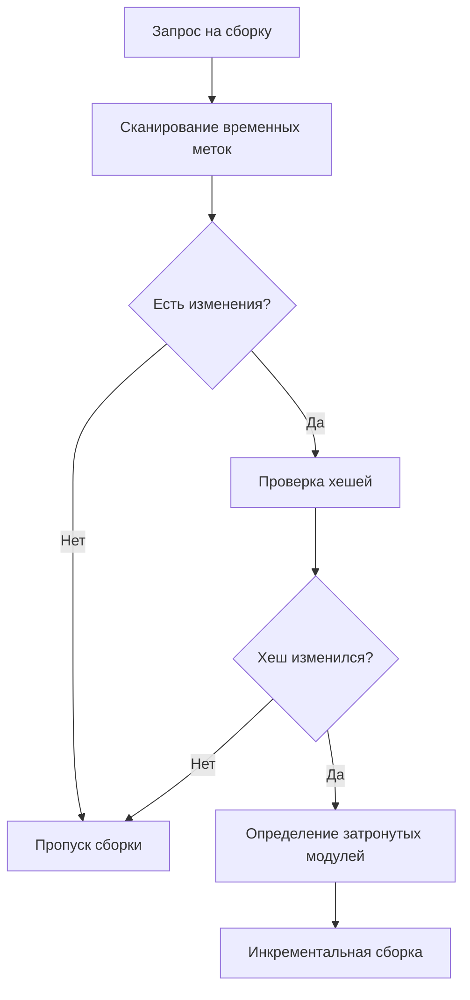
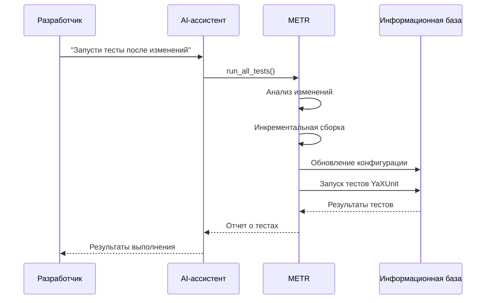
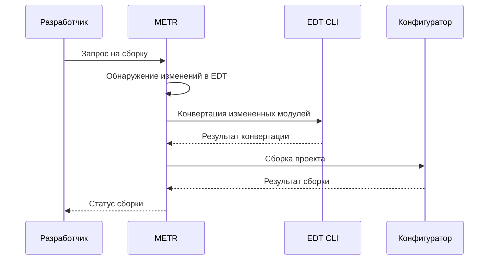

# Основные возможности METR

METR (MCP 1C:Enterprise Test Runner) — это мощный инструмент для автоматизации тестирования и сборки проектов 1С:Предприятие через протокол MCP (Model Context Protocol). Этот документ описывает все основные возможности системы.

## Содержание

1. [Запуск тестов](#запуск-тестов)
2. [Сборка проекта](#сборка-проекта)
3. [Запуск приложений 1С](#запуск-приложений-1с)
4. [Поддержка форматов проектов](#поддержка-форматов-проектов)
5. [Интеллектуальная сборка](#интеллектуальная-сборка)
6. [Интеграция с инструментами разработки](#интеграция-с-инструментами-разработки)
7. [MCP-инструменты](#mcp-инструменты)

## Запуск тестов

METR предоставляет гибкие возможности для запуска тестов YaXUnit в различных сценариях.

### Запуск всех тестов проекта

Запускает все тесты, найденные в проекте. Перед запуском тестов автоматически выполняется сборка проекта (если обнаружены изменения).

**Особенности:**

- Автоматический анализ изменений перед запуском
- Инкрементальная сборка только измененных модулей
- Подробный отчет о результатах выполнения
- Детальная статистика: общее количество, пройденные, проваленные тесты
- Время выполнения тестов

### Запуск тестов отдельного модуля

Позволяет запустить тесты только из указанного модуля. Полезно для фокусного тестирования конкретной функциональности.

**Особенности:**

- Избирательный запуск тестов
- Быстрое выполнение при работе с отдельными модулями
- Автоматическая сборка только при необходимости

**Параметры:**

- `moduleName` — имя модуля для тестирования

## Сборка проекта

METR автоматизирует процесс сборки проектов 1С с поддержкой различных стратегий сборки.

### Инкрементальная сборка

Система автоматически определяет, какие модули были изменены, и выполняет сборку только измененных частей проекта.

**Преимущества:**

- Значительное сокращение времени сборки
- Экономия ресурсов системы
- Автоматическое определение области изменений

**Процесс:**

1. Анализ изменений в исходных файлах
2. Определение затронутых модулей
3. Выборочная сборка только измененных модулей
4. Обновление информационной базы

### Полная сборка

При необходимости система может выполнить полную пересборку всего проекта.

**Когда выполняется:**

- При первом запуске
- При изменении критических файлов конфигурации
- При явном запросе пользователя
    > [!WARNING] Not support
    > Будет реализовано в [Issue #11](https://github.com/alkoleft/mcp-onec-test-runner/issues/11)

### Поддержка различных сборщиков

METR поддерживает несколько инструментов сборки:

#### DESIGNER (Конфигуратор 1С)

Классический способ сборки через локальный конфигуратор 1С.

**Особенности:**

- Подходит для локальной разработки
- Не требует дополнительных инструментов
- Прямая интеграция с платформой 1С

**Настройка:**

```yaml
app:
  tools:
    builder: DESIGNER
```

#### IBMCMD

Инструмент командной строки для автоматизации сборки без графического интерфейса.

**Особенности:**

- Не блокируется конфигуратором и EDT
- Выполняется быстрее благодаря отсутствию GUI

**Настройка:**

```yaml
app:
  tools:
    builder: IBMCMD
```

## Запуск приложений 1С

METR может автоматически запускать различные приложения платформы 1С:Предприятие.

### Конфигуратор (Designer)

Запускает конфигуратор 1С для визуального редактирования конфигурации.

**Псевдонимы:**

- `DESIGNER`
- `designer`
- `1cv8`
- `конфигуратор`

### Тонкий клиент (Thin Client)

Запускает тонкий клиент 1С:Предприятие для работы с информационной базой.

**Псевдонимы:**

- `THIN_CLIENT`
- `thin_client`
- `1cv8c`
- `тонкий клиент`

### Толстый клиент (Thick Client)

Запускает толстый клиент 1С:Предприятие для работы с информационной базой.

**Псевдонимы:**

- `THICK_CLIENT`
- `thick_client`
- `толстый клиент`

## Поддержка форматов проектов

METR поддерживает работу с проектами в различных форматах организации исходного кода.

### Формат DESIGNER

Традиционный формат проекта 1С, используемый конфигуратором.

**Особенности:**

- Прямая работа с исходниками конфигуратора
- Не требует дополнительных инструментов
- Подходит для классических проектов 1С

**Настройка:**

```yaml
app:
  format: DESIGNER
```

### Формат EDT

Формат проекта, используемый 1C:Enterprise Development Tools (EDT) — современной средой разработки для 1С.

**Особенности:**

- Современная структура проекта
- Поддержка версионирования через Git
- Интеграция с IDE (Eclipse-based)
- Автоматическая конвертация в формат DESIGNER

**Требования:**

- 1C:EDT 2025.1+ (см. [Issue #1758](https://github.com/1C-Company/1c-edt-issues/issues/1758))

**Настройка:**

```yaml
app:
  format: EDT
  tools:
    edt-cli:
      auto-start: true # Автоматический запуск 1C:EDT в интерактивном режиме
      version: "latest"
      working-directory: "edt-workspace-path"
```

## Интеллектуальная сборка

METR использует продвинутые алгоритмы для оптимизации процесса сборки и тестирования.

### Анализ изменений

Система отслеживает изменения в исходных файлах проекта с использованием двухфазного алгоритма:

#### Фаза 1: Быстрое предварительное сканирование

Проверка временных меток файлов (timestamps) для быстрого определения потенциально измененных файлов.

**Преимущества:**

- Очень быстрое сканирование больших проектов
- Минимальная нагрузка на систему
- Раннее определение отсутствия изменений

#### Фаза 2: Проверка хешей содержимого

Для файлов с измененными временными метками выполняется проверка SHA-256 хеша содержимого.

**Преимущества:**

- Точное определение реальных изменений
- Игнорирование ложных срабатываний
- Обнаружение откатов изменений

**Процесс:**



### Кэширование состояния сборки

METR сохраняет состояние сборки для каждого модуля, что позволяет:

- Быстро определять, нужна ли пересборка
- Отслеживать историю изменений
- Оптимизировать последующие запуски

**Хранение:**

- Хеши файлов для отслеживания изменений
- Временные метки последней сборки

### Автоматическая конвертация из EDT

При работе с проектами в формате EDT система автоматически конвертирует измененные модули в формат DESIGNER перед сборкой.

**Особенности:**

- Автоматическое определение необходимости конвертации
- Конвертация только измененных модулей
- Использование EDT CLI в интерактивном режиме для ускорения

**Процесс:**

1. Обнаружение изменений в EDT-проекте
2. Определение измененных модулей
3. Конвертация через EDT CLI
4. Сборка в формате DESIGNER

## Интеграция с инструментами разработки

### Интеграция с EDT CLI

METR поддерживает работу с EDT CLI (Command Line Interface) для автоматизации работы с проектами EDT.

#### Интерактивный режим

Система может запускать EDT CLI в интерактивном режиме, что значительно ускоряет выполнение команд.

**Преимущества:**

- Быстрая инициализация (EDT CLI запускается заранее)
- Снижение накладных расходов на запуск
- Повышение производительности при множественных операциях

**Настройка:**

```yaml
app:
  tools:
    edt-cli:
      auto-start: true              # Автозапуск при старте
      startup-timeout-ms: 30000     # Таймаут запуска
      command-timeout-ms: 300000    # Таймаут команды
      ready-check-timeout-ms: 5000  # Таймаут проверки готовности
```

**Работа:**

- EDT CLI запускается при старте METR (если включен `auto-start`)
- Команды отправляются в уже запущенный процесс
- Процесс остается активным между командами
- Автоматическое определение готовности к выполнению команд

## MCP-инструменты

METR предоставляет следующие инструменты через протокол MCP:

### `run_all_tests`

Запускает все тесты в проекте.

**Параметры:** нет

**Возвращает:**

- Статус выполнения
- Количество тестов (общее, пройденные, проваленные)
- Время выполнения
- Детальная информация о тестах
- Шаги выполнения (при ошибках)

### `run_module_tests`

Запускает тесты из указанного модуля.

**Параметры:**

- `moduleName` (string) — имя модуля для тестирования

**Возвращает:**

- Статус выполнения
- Статистика по тестам
- Детальная информация

### `build_project`

Выполняет сборку проекта.

**Параметры:** нет

**Возвращает:**

- Статус сборки
- Сообщение о результате
- Время сборки
- Шаги выполнения (при ошибках)

### `launch_app`

Запускает приложение 1С указанного типа.

**Параметры:**

- `utilityType` (string) — псевдоним типа приложения

**Возвращает:**

- Статус запуска
- Идентификатор запущенного процесса (pid)

## Дополнительные возможности

### Логирование

METR предоставляет подробное логирование всех операций:

- Уровни логирования: TRACE, DEBUG, INFO, WARN, ERROR
- Структурированные логи для анализа
- Логи выполнения команд 1С сохраняются отдельно

### Обработка ошибок

Система обеспечивает надежную обработку ошибок:

- Детальные сообщения об ошибках
- Информация о шагах, приведших к ошибке
- Восстановление после временных сбоев

### Кросс-платформенность

METR работает на различных платформах:

- **Linux** — полная поддержка
- **Windows** — полная поддержка
- **macOS** — поддержка (экспериментально)

### Производительность

Система оптимизирована для работы с большими проектами:

- Параллельная обработка файлов
- Эффективное использование ресурсов
- Минимизация времени выполнения операций

---

## Примеры использования

### Сценарий 1: Разработка с автоматическим тестированием



### Сценарий 2: Работа с EDT проектом



---

## Заключение

METR предоставляет комплексное решение для автоматизации тестирования и сборки проектов 1С:Предприятие. Благодаря интеграции с протоколом MCP, система легко интегрируется с современными AI-ассистентами и IDE, обеспечивая seamless workflow для разработчиков.

**Основные преимущества:**

- 🚀 Автоматизация рутинных операций
- ⚡ Оптимизация времени сборки через инкрементальную сборку
- 🔍 Интеллектуальное определение изменений
- 🛠️ Поддержка различных форматов проектов
- 🔌 Интеграция с современными инструментами разработки
- 📊 Подробная отчетность и логирование

Для начала работы см. [Application Configuration](APPLICATION_CONFIGURATION.md) и [IDE Setup](IDE_SETUP.md).
