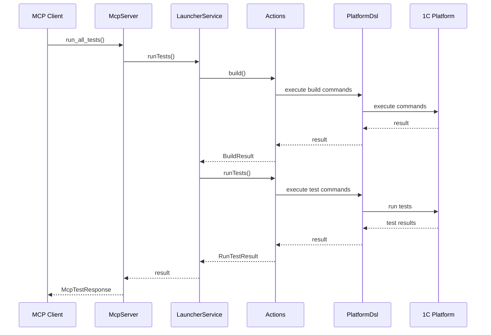
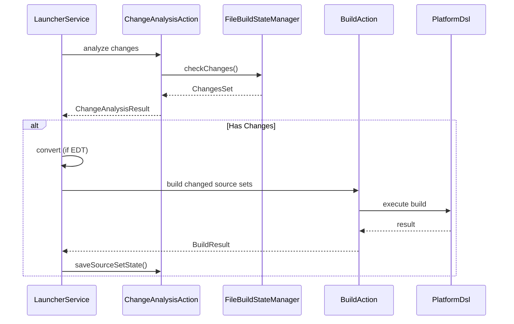
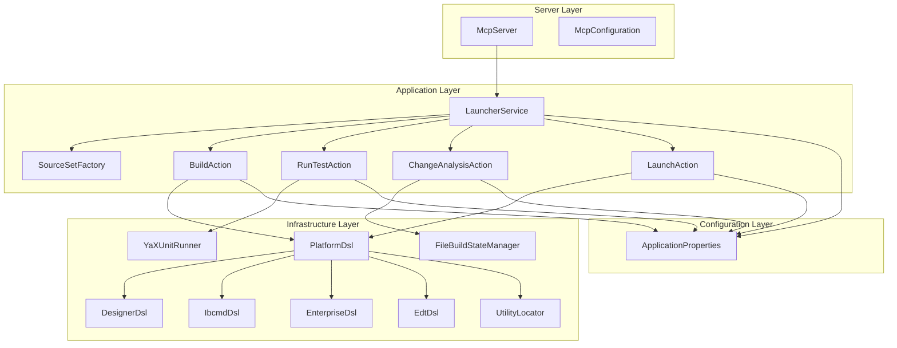

# Архитектура системы METR

## Обзор

METR (MCP 1C:Enterprise Test Runner) - это MCP-сервер для автоматизации тестирования и сборки проектов 1С:Предприятие. Система построена на основе слоистой архитектуры с четким разделением ответственности между слоями.

## Архитектурные слои

### 1. Server Layer (Слой сервера)

**Пакет:** `io.github.alkoleft.mcp.server`

Точка входа в систему через протокол MCP. Предоставляет инструменты для AI-ассистентов.

**Компоненты:**
- `McpServer` - основной сервис MCP с инструментами
- `McpConfiguration` - конфигурация Spring для регистрации MCP инструментов

**Ответственность:**
- Прием запросов через MCP протокол
- Делегирование выполнения операций в сервисы
- Преобразование результатов в формат MCP-ответов

### 2. Application Layer (Слой приложения)

**Пакеты:**
- `io.github.alkoleft.mcp.application.actions` - система действий
- `io.github.alkoleft.mcp.application.services` - сервисы прикладного уровня
- `io.github.alkoleft.mcp.application.core` - базовые доменные модели

**Ответственность:**
- Координация выполнения операций
- Управление бизнес-логикой
- Оркестрация действий

**Основные компоненты:**
- `LauncherService` - координатор выполнения операций
- `SourceSetFactory` - фабрика для создания source set
- Различные действия (BuildAction, RunTestAction, ChangeAnalysisAction и т.д.)

### 3. Infrastructure Layer (Слой инфраструктуры)

**Пакеты:**
- `io.github.alkoleft.mcp.infrastructure.platform.dsl` - DSL для работы с платформой 1С
- `io.github.alkoleft.mcp.infrastructure.platform.locator` - поиск утилит платформы
- `io.github.alkoleft.mcp.infrastructure.platform.search` - стратегии поиска
- `io.github.alkoleft.mcp.infrastructure.storage` - хранение состояния сборки
- `io.github.alkoleft.mcp.infrastructure.yaxunit` - интеграция с YaXUnit
- `io.github.alkoleft.mcp.infrastructure.utility` - утилиты

**Ответственность:**
- Взаимодействие с внешними системами (платформа 1С, файловая система)
- Выполнение команд платформы
- Управление состоянием и кэшированием

### 4. Configuration Layer (Слой конфигурации)

**Пакет:** `io.github.alkoleft.mcp.configuration`

Управление конфигурацией приложения.

**Ответственность:**
- Загрузка конфигурации из файлов
- Валидация конфигурации
- Предоставление типизированного доступа к настройкам

## Основные потоки данных

### Поток выполнения тестов

### Поток интеллектуальной сборки

## Ключевые паттерны

### 1. Command Pattern (Паттерн Команда)

Действия (Actions) инкапсулируют запросы на выполнение операций как объекты, позволяя параметризовать клиентов различными запросами.

**Примеры:**
- `BuildAction` - команда сборки
- `RunTestAction` - команда запуска тестов
- `LaunchAction` - команда запуска приложения

### 2. Factory Pattern (Паттерн Фабрика)

`ActionFactory` создает экземпляры действий, инкапсулируя логику создания.

### 3. Strategy Pattern (Паттерн Стратегия)

Различные стратегии поиска утилит (`SearchStrategy`) и различные реализации действий (например, `DesignerBuildAction` vs `IbcmdBuildAction`).

### 4. DSL Pattern (Domain-Specific Language)

Fluent API для построения команд платформы 1С через `PlatformDsl` и его под-DSL.

### 5. Enhanced Hybrid Hash Detection

Двухфазный алгоритм обнаружения изменений:
- Фаза 1: Быстрое сканирование временных меток
- Фаза 2: Точная проверка хешей для потенциально измененных файлов

## Диаграмма компонентов

## Принципы проектирования

### SOLID принципы

- **Single Responsibility** - каждый класс имеет одну ответственность
- **Open/Closed** - открыт для расширения, закрыт для модификации (через интерфейсы действий)
- **Liskov Substitution** - реализации действий взаимозаменяемы
- **Interface Segregation** - интерфейсы действий специфичны для своих задач
- **Dependency Inversion** - зависимости направлены на абстракции (интерфейсы)

### Другие принципы

- **Separation of Concerns** - четкое разделение ответственности между слоями
- **DRY (Don't Repeat Yourself)** - переиспользование кода через базовые классы и утилиты
- **KISS (Keep It Simple, Stupid)** - простота решений
- **YAGNI (You Aren't Gonna Need It)** - реализация только необходимого функционала

## Технологический стек

- **Kotlin** - язык программирования
- **Spring Boot** - фреймворк приложения
- **Spring AI MCP Server** - интеграция с MCP протоколом
- **MapDB** - персистентное хранение
- **Jackson** - сериализация/десериализация JSON
- **Kotlin Coroutines** - асинхронное программирование

## Расширяемость

Система спроектирована для легкого расширения:

1. **Новые действия** - реализация интерфейсов действий
2. **Новые стратегии сборки** - реализация `BuildAction`
3. **Новые DSL** - расширение `PlatformDsl`
4. **Новые стратегии поиска** - реализация `SearchStrategy`

## Производительность

### Оптимизации

1. **Инкрементальная сборка** - сборка только измененных модулей
2. **Enhanced Hybrid Hash Detection** - быстрое обнаружение изменений
3. **Кэширование утилит** - кэширование найденных утилит платформы
4. **Интерактивный режим EDT CLI** - ускорение выполнения команд конвертации
5. **Параллельная обработка** - использование Kotlin Coroutines для параллельной обработки файлов

## Безопасность

- Валидация конфигурации при загрузке
- Проверка существования и доступности файлов
- Обработка ошибок на всех уровнях
- Логирование для аудита операций

