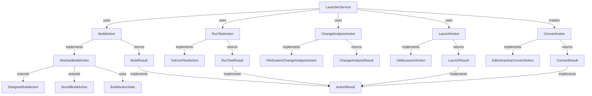

# Пакет `io.github.alkoleft.mcp.application.actions`

## Назначение

Пакет `application.actions` содержит систему действий (Actions) для выполнения основных операций в системе METR: сборка проектов, запуск тестов, анализ изменений, конвертация проектов и запуск приложений 1С:Предприятие. Пакет реализует паттерн Command и обеспечивает единообразный интерфейс для выполнения различных операций.

## Архитектура

Система действий построена на основе следующих принципов:
- **Интерфейсы действий** - определяют контракты для различных типов операций
- **Реализации действий** - конкретные реализации для различных инструментов и сценариев
- **Результаты действий** - структурированные результаты выполнения с информацией об ошибках и шагах
- **Состояние действий** - классы для отслеживания состояния выполнения действий

## Основные компоненты

### Интерфейсы действий

#### BuildAction

**Интерфейс:** `io.github.alkoleft.mcp.application.actions.common.BuildAction`

Интерфейс для сборки конфигурации и расширений. Определяет контракт для выполнения сборки проекта 1С:Предприятие.

**Методы:**
- `run(properties: ApplicationProperties, sourceSet: SourceSet): BuildResult` - выполняет сборку проекта

**Реализации:**
- `DesignerBuildAction` - сборка через конфигуратор 1С
- `IbcmdBuildAction` - сборка через ibcmd

#### ConvertAction

**Интерфейс:** `io.github.alkoleft.mcp.application.actions.common.ConvertAction`

Интерфейс для конвертации проектов между форматами (например, из формата EDT в формат DESIGNER).

**Методы:**
- `run(properties: ApplicationProperties, sourceSet: SourceSet, destination: SourceSet): ConvertResult` - выполняет конвертацию

**Реализации:**
- `EdtInteractiveConvertAction` - конвертация через EDT CLI в интерактивном режиме

#### ChangeAnalysisAction

**Интерфейс:** `io.github.alkoleft.mcp.application.actions.common.ChangeAnalysisAction`

Интерфейс для анализа изменений в файловой системе проекта с целью определения необходимости пересборки.

**Методы:**
- `run(): ChangeAnalysisResult` - выполняет анализ изменений
- `saveSourceSetState(sourceSetChanges: SourceSetChanges, timeStamp: Long, success: Boolean): Boolean` - сохраняет состояние source set

**Реализации:**
- `FileSystemChangeAnalysisAction` - анализ изменений с использованием Enhanced Hybrid Hash Detection

#### RunTestAction

**Интерфейс:** `io.github.alkoleft.mcp.application.actions.common.RunTestAction`

Интерфейс для запуска тестов YaXUnit в проекте 1С:Предприятие.

**Методы:**
- `run(request: TestExecutionRequest): RunTestResult` - выполняет запуск тестов

**Реализации:**
- `YaXUnitTestAction` - запуск тестов через YaXUnitRunner

#### LaunchAction

**Интерфейс:** `io.github.alkoleft.mcp.application.actions.common.LaunchAction`

Интерфейс для запуска приложений 1С:Предприятие (конфигуратор, тонкий клиент, толстый клиент).

**Методы:**
- `run(request: LaunchRequest): LaunchResult` - запускает приложение указанного типа

**Реализации:**
- `UtilityLaunchAction` - запуск приложений через PlatformDsl

### Реализации действий

#### AbstractBuildAction

**Класс:** `io.github.alkoleft.mcp.application.actions.build.AbstractBuildAction`

Абстрактный базовый класс для BuildAction, предоставляющий общую функциональность для измерения времени выполнения, обработки ошибок и логирования.

**Основные методы:**
- `run(properties: ApplicationProperties, sourceSet: SourceSet): BuildResult` - выполняет полную сборку с измерением времени
- `executeBuildDsl(properties: ApplicationProperties, sourceSet: SourceSet): BuildResult` - выполняет DSL сборки
- `initDsl(properties: ApplicationProperties): Unit` - инициализирует DSL (абстрактный)
- `loadConfiguration(name: String, path: Path): ProcessResult` - загружает конфигурацию (абстрактный)
- `loadExtension(name: String, path: Path): ProcessResult` - загружает расширение (абстрактный)
- `updateDb(): ProcessResult?` - обновляет базу данных (абстрактный)

#### BuildActionState

**Класс:** `io.github.alkoleft.mcp.application.actions.build.BuildActionState`

Состояние выполнения сборки проекта. Отслеживает результаты выполнения команд для каждого элемента source set и результаты обновления базы данных.

**Методы:**
- `addResult(name: String, result: ProcessResult, description: String)` - добавляет результат выполнения команды
- `registerUpdateResult(result: ProcessResult)` - регистрирует результат обновления базы данных
- `toResult(message: String): BuildResult` - преобразует состояние в результат сборки

#### DesignerBuildAction

**Класс:** `io.github.alkoleft.mcp.application.actions.build.DesignerBuildAction`

Реализация BuildAction для сборки через конфигуратор 1С. Активируется при `app.tools.builder=DESIGNER`.

**Особенности:**
- Использует DesignerDsl для работы с конфигуратором
- Отключает диалоги и сообщения для автоматической работы
- Загружает конфигурацию и расширения из файлов

#### IbcmdBuildAction

**Класс:** `io.github.alkoleft.mcp.application.actions.build.IbcmdBuildAction`

Реализация BuildAction для сборки через ibcmd. Активируется при `app.tools.builder=IBCMD`.

**Особенности:**
- Использует IbcmdDsl для работы с ibcmd
- Извлекает путь к базе данных из строки подключения
- Выполняет импорт конфигурации и расширений, затем применяет изменения

#### FileSystemChangeAnalysisAction

**Класс:** `io.github.alkoleft.mcp.application.actions.change.FileSystemChangeAnalysisAction`

Реализация ChangeAnalysisAction для анализа изменений в файловой системе с использованием Enhanced Hybrid Hash Detection и группировкой по source set.

**Основные методы:**
- `run(): ChangeAnalysisResult` - выполняет анализ изменений
- `saveSourceSetState(sourceSetChanges: SourceSetChanges, timeStamp: Long, success: Boolean): Boolean` - сохраняет состояние

**Процесс:**
1. Проверка изменений через FileBuildStateManager
2. Группировка изменений по source set через SourceSetChangeAnalyzer
3. Сохранение состояния после успешной сборки

#### SourceSetChangeAnalyzer

**Класс:** `io.github.alkoleft.mcp.application.actions.change.SourceSetChangeAnalyzer`

Анализатор изменений, который группирует изменения файлов по source set для оптимизации сборки.

**Методы:**
- `analyzeSourceSetChanges(allChanges: ChangesSet): Map<String, SourceSetChanges>` - анализирует и группирует изменения

#### YaXUnitTestAction

**Класс:** `io.github.alkoleft.mcp.application.actions.test.yaxunit.YaXUnitTestAction`

Реализация RunTestAction для тестирования через YaXUnit. Поддерживает запуск всех тестов, тестов модуля и конкретных тестов.

**Процесс выполнения:**
1. Запуск тестов через YaXUnitRunner
2. Парсинг отчета о тестировании через ReportParser
3. Извлечение ошибок из лога через LogParser
4. Формирование результата с детальной информацией

**Внутренний класс:**
- `TestActionState` - состояние выполнения тестов с отслеживанием результатов и ошибок

#### UtilityLaunchAction

**Класс:** `io.github.alkoleft.mcp.application.actions.launch.UtilityLaunchAction`

Реализация LaunchAction для запуска приложений платформы 1С через PlatformDsl.

**Поддерживаемые типы приложений:**
- DESIGNER (конфигуратор)
- THIN_CLIENT (тонкий клиент)
- THICK_CLIENT (толстый клиент)

**Псевдонимы:**
- DESIGNER: "designer", "1cv8", "конфигуратор"
- THIN_CLIENT: "thin_client", "1cv8c", "тонкий клиент", "тонкий"
- THICK_CLIENT: "thick_client", "толстый клиент", "толстый"

#### EdtInteractiveConvertAction

**Класс:** `io.github.alkoleft.mcp.application.actions.convert.EdtInteractiveConvertAction`

Реализация ConvertAction для конвертации проектов из формата EDT в формат DESIGNER с использованием интерактивного режима EDT CLI.

**Процесс:**
1. Инициализация EdtDsl
2. Экспорт каждого элемента source set из EDT формата
3. Сохранение результатов конвертации

### Модели данных

#### BuildResult

**Класс:** `io.github.alkoleft.mcp.application.actions.common.BuildResult`

Результат сборки проекта. Содержит информацию о статусе, ошибках, времени выполнения и результатах для каждого элемента source set.

**Свойства:**
- `message: String` - сообщение о результате
- `success: Boolean` - успешность сборки
- `errors: List<String>` - список ошибок
- `duration: Duration` - время выполнения
- `steps: List<ActionStepResult>` - шаги выполнения
- `sourceSet: Map<String, ShellCommandResult>` - результаты для каждого source set

#### ConvertResult

**Класс:** `io.github.alkoleft.mcp.application.actions.common.ConvertResult`

Результат конвертации проекта. Содержит информацию о статусе, ошибках и результатах конвертации. Реализует интерфейс `ActionResult` для единообразия структуры результатов.

#### ChangeAnalysisResult

**Класс:** `io.github.alkoleft.mcp.application.actions.common.ChangeAnalysisResult`

Результат анализа изменений. Содержит информацию об обнаруженных изменениях, сгруппированных по source set.

**Свойства:**
- `hasChanges: Boolean` - наличие изменений
- `changedFiles: Set<Path>` - множество измененных файлов
- `changeTypes: ChangesSet` - типы изменений для каждого файла
- `sourceSetChanges: Map<String, SourceSetChanges>` - изменения по source set
- `steps: List<ActionStepResult>` - шаги анализа
- `timestamp: Long` - временная метка

#### RunTestResult

**Класс:** `io.github.alkoleft.mcp.application.actions.common.RunTestResult`

Результат выполнения тестов. Содержит полную информацию о результатах тестирования, включая отчет, пути к логам и ошибки.

**Свойства:**
- `success: Boolean` - успешность выполнения
- `duration: Duration` - время выполнения
- `message: String` - сообщение о результате
- `errors: List<String>` - список ошибок
- `steps: List<ActionStepResult>` - шаги выполнения
- `report: GenericTestReport?` - отчет о тестировании
- `reportPath: Path?` - путь к файлу отчета
- `enterpriseLogPath: String?` - путь к логу 1С:Предприятие
- `logPath: String?` - путь к логу YaXUnit

#### LaunchResult

**Класс:** `io.github.alkoleft.mcp.application.actions.common.LaunchResult`

Результат запуска приложения. Содержит информацию о статусе запуска и идентификаторе процесса.

**Свойства:**
- `success: Boolean` - успешность запуска
- `duration: Duration` - время выполнения
- `message: String` - сообщение о результате
- `errors: List<String>` - список ошибок
- `steps: List<ActionStepResult>` - шаги выполнения
- `processId: Long?` - идентификатор процесса (PID)

#### ActionResult

**Интерфейс:** `io.github.alkoleft.mcp.application.actions.common.ActionResult`

Базовый интерфейс для всех результатов выполнения действий. Определяет общий контракт.

**Свойства:**
- `message: String` - сообщение о результате
- `success: Boolean` - успешность выполнения
- `errors: List<String>` - список ошибок
- `duration: Duration` - время выполнения
- `steps: List<ActionStepResult>` - шаги выполнения

#### ActionStepResult

**Класс:** `io.github.alkoleft.mcp.application.actions.common.ActionStepResult`

Результат выполнения отдельного шага действия. Используется для диагностики и отслеживания прогресса.

**Свойства:**
- `message: String` - сообщение о результате шага
- `success: Boolean` - успешность выполнения шага
- `error: String?` - текст ошибки (если есть)
- `duration: Duration` - время выполнения шага

### Модели тестирования

#### TestExecutionRequest

**Интерфейс:** `io.github.alkoleft.mcp.application.actions.test.yaxunit.TestExecutionRequest`

Базовый интерфейс для запросов на выполнение тестов.

**Реализации:**
- `RunAllTestsRequest` - запрос на запуск всех тестов
- `RunModuleTestsRequest(moduleName: String)` - запрос на запуск тестов модуля
- `RunListTestsRequest(moduleNames: List<String>)` - запрос на запуск списка тестов

#### GenericTestReport

**Класс:** `io.github.alkoleft.mcp.application.actions.test.yaxunit.GenericTestReport`

Универсальная структура отчета о тестировании.

**Свойства:**
- `metadata: TestMetadata` - метаданные тестирования
- `summary: TestSummary` - сводка по тестам
- `testSuites: List<GenericTestSuite>` - список наборов тестов
- `timestamp: Instant` - временная метка
- `duration: Duration` - время выполнения

#### TestSummary

**Класс:** `io.github.alkoleft.mcp.application.actions.test.yaxunit.TestSummary`

Сводка по результатам тестирования.

**Свойства:**
- `totalTests: Int` - общее количество тестов
- `passed: Int` - количество пройденных тестов
- `failed: Int` - количество проваленных тестов
- `skipped: Int` - количество пропущенных тестов
- `errors: Int` - количество тестов с ошибками
- `successRate: Double` - процент успешных тестов

#### GenericTestSuite

**Класс:** `io.github.alkoleft.mcp.application.actions.test.yaxunit.GenericTestSuite`

Набор тестов (test suite).

**Свойства:**
- `name: String` - имя набора тестов
- `tests: Int` - количество тестов
- `passed: Int` - количество пройденных
- `failed: Int` - количество проваленных
- `skipped: Int` - количество пропущенных
- `errors: Int` - количество с ошибками
- `duration: Duration` - время выполнения
- `testCases: List<GenericTestCase>` - список тестовых случаев

#### GenericTestCase

**Класс:** `io.github.alkoleft.mcp.application.actions.test.yaxunit.GenericTestCase`

Отдельный тестовый случай.

**Свойства:**
- `name: String` - имя теста
- `className: String?` - имя класса
- `status: TestStatus` - статус теста
- `duration: Duration` - время выполнения
- `errorMessage: String?` - сообщение об ошибке
- `stackTrace: String?` - стек вызовов
- `systemOut: String?` - стандартный вывод
- `systemErr: String?` - стандартный вывод ошибок

#### TestStatus

**Enum:** `io.github.alkoleft.mcp.application.actions.test.yaxunit.TestStatus`

Статус выполнения теста:
- `PASSED` - тест пройден
- `FAILED` - тест провален
- `SKIPPED` - тест пропущен
- `ERROR` - ошибка при выполнении теста

#### ChangeType

**Enum:** `io.github.alkoleft.mcp.application.actions.test.yaxunit.ChangeType`

Тип изменения файла:
- `NEW` - новый файл
- `MODIFIED` - измененный файл
- `DELETED` - удаленный файл
- `UNCHANGED` - файл не изменен

### Исключения

#### ActionError

**Класс:** `io.github.alkoleft.mcp.application.actions.exceptions.ActionError`

Базовый класс для всех ошибок действий. Содержит контекстную информацию об ошибке.

**Свойства:**
- `context: Map<String, Any>` - контекстная информация об ошибке

**Наследники:**
- `BuildError` - ошибка сборки проекта
- `ConfigurationError` - ошибка конфигурации
- `LaunchError` - ошибка запуска приложения
- `AnalysisError` - ошибка анализа изменений
- `TestExecutionError` - ошибка выполнения тестов

### Вспомогательные классы

#### ActionState

**Класс:** `io.github.alkoleft.mcp.application.actions.common.ActionState`

Базовый класс для отслеживания состояния выполнения действия. Предоставляет функциональность для добавления шагов и отслеживания успешности выполнения.

**Свойства:**
- `success: Boolean` - успешность выполнения
- `steps: MutableList<ActionStepResult>` - список шагов

**Методы:**
- `addStep(step: ActionStepResult)` - добавляет шаг выполнения

#### SourceSetChanges

**Класс:** `io.github.alkoleft.mcp.application.actions.change.SourceSetChanges`

Представляет изменения в рамках конкретного source set.

**Свойства:**
- `sourceSetName: String` - имя source set
- `sourceSetPath: String` - путь к source set
- `changedFiles: Set<Path>` - множество измененных файлов
- `changeTypes: ChangesSet` - типы изменений

## Вспомогательные функции

### Расширяющие функции

#### `ShellCommandResult.toActionStepResult(description: String, additionMessage: String?): ActionStepResult`

Преобразует результат выполнения команды оболочки в результат шага действия.

**Параметры:**
- `description` - описание шага
- `additionMessage` - дополнительное сообщение

#### `ShellCommandResult.fullError(): String`

Извлекает полный текст ошибки из результата команды, включая вывод процесса.

## Связи с другими модулями

### Зависимости

- **infrastructure.platform.dsl** - используется для выполнения команд платформы 1С
- **infrastructure.storage** - используется для отслеживания состояния сборки
- **infrastructure.yaxunit** - используется для запуска тестов и парсинга отчетов
- **configuration.properties** - используется для получения конфигурации проекта
- **application.core** - используется для базовых типов данных

### Используется в

- **application.services.LauncherService** - использует действия для выполнения операций
- **server.McpServer** - использует результаты действий для формирования MCP-ответов

## Примеры использования

### Сборка проекта

```kotlin
val buildAction: BuildAction = DesignerBuildAction(platformDsl)
val result = buildAction.run(properties, sourceSet)
if (result.success) {
    println("Сборка завершена успешно за ${result.duration}")
} else {
    println("Ошибки сборки: ${result.errors.joinToString()}")
}
```

### Анализ изменений

```kotlin
val changeAction: ChangeAnalysisAction = FileSystemChangeAnalysisAction(buildStateManager, sourceSetAnalyzer)
val analysis = changeAction.run()
if (analysis.hasChanges) {
    println("Обнаружено ${analysis.changedFiles.size} измененных файлов")
    analysis.sourceSetChanges.forEach { (name, changes) ->
        println("Source set $name: ${changes.changedFiles.size} изменений")
    }
}
```

### Запуск тестов

```kotlin
val testAction: RunTestAction = YaXUnitTestAction(reportParser, yaxUnitRunner)
val request = RunAllTestsRequest()
val result = testAction.run(request)
println("Тестов выполнено: ${result.report?.summary?.totalTests}")
println("Успешно: ${result.report?.summary?.passed}")
```

### Запуск приложения

```kotlin
val launchAction: LaunchAction = UtilityLaunchAction(platformDsl, properties)
val request = LaunchRequest("designer")
val result = launchAction.run(request)
if (result.success) {
    println("Приложение запущено, PID: ${result.processId}")
}
```

## Диаграмма взаимодействий



## Примечания

- Все действия обрабатывают исключения и возвращают структурированные результаты с информацией об ошибках
- Время выполнения операций измеряется для всех действий
- Логирование выполняется на всех этапах выполнения действий
- Состояние выполнения действий отслеживается через ActionState и ActionStepResult
- Результаты действий могут содержать детальную информацию о шагах выполнения для диагностики

