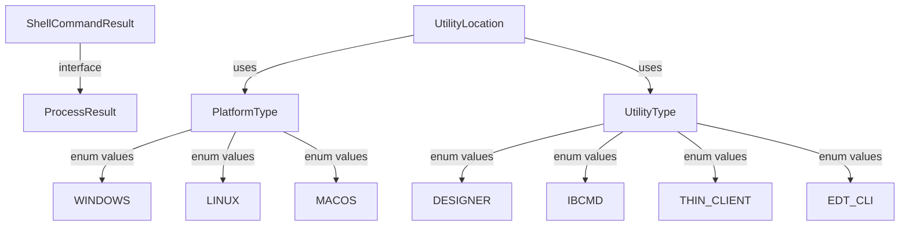

# Пакет `io.github.alkoleft.mcp.application.core`

## Назначение

Пакет `application.core` содержит базовые типы данных и доменные модели, используемые на уровне приложения. Эти типы представляют основные концепции системы и используются во всех слоях приложения.

## Основные компоненты

### UtilityLocation

**Класс:** `io.github.alkoleft.mcp.application.core.UtilityLocation`

Представляет информацию о расположении утилиты платформы 1С:Предприятие.

**Свойства:**
- `executablePath: Path` - путь к исполняемому файлу утилиты
- `version: String?` - версия утилиты (может быть null, если версия не определена)
- `platformType: PlatformType` - тип платформы (Windows, Linux, macOS)

**Использование:**
Используется для хранения информации о найденных утилитах платформы 1С, полученных от `UtilityLocator`.

### PlatformType

**Enum:** `io.github.alkoleft.mcp.application.core.PlatformType`

Тип операционной системы платформы.

**Значения:**
- `WINDOWS` - операционная система Windows
- `LINUX` - операционная система Linux
- `MACOS` - операционная система macOS

**Использование:**
Используется для определения типа платформы при поиске утилит и выполнении платформо-зависимых операций.

### UtilityType

**Enum:** `io.github.alkoleft.mcp.application.core.UtilityType`

Тип утилиты платформы 1С:Предприятие.

**Значения:**
- `DESIGNER("1cv8")` - конфигуратор 1С
- `IBCMD("ibcmd")` - утилита командной строки ibcmd
- `IBSRV("ibsrv")` - сервер 1С
- `THIN_CLIENT("1cv8c")` - тонкий клиент 1С
- `THICK_CLIENT("1cv8")` - толстый клиент 1С
- `EDT_CLI("1cedtcli")` - CLI утилита 1C:EDT

**Свойства:**
- `fileName: String` - имя исполняемого файла утилиты

**Методы:**
- `isPlatform(): Boolean` - возвращает true, если утилита является частью платформы 1С (не EDT CLI)

**Использование:**
Используется для указания типа утилиты при поиске и запуске утилит платформы 1С.

### ShellCommandResult

**Интерфейс:** `io.github.alkoleft.mcp.application.core.ShellCommandResult`

Базовый интерфейс для результатов выполнения команд оболочки. Определяет общий контракт для всех результатов выполнения команд.

**Свойства:**
- `success: Boolean` - успешность выполнения команды
- `duration: Duration` - время выполнения команды
- `output: String` - стандартный вывод команды
- `error: String?` - текст ошибки (может быть null, если ошибок нет)
- `exitCode: Int` - код возврата команды

**Реализации:**
- `ProcessResult` - результат выполнения процесса через ProcessExecutor

**Использование:**
Используется для представления результатов выполнения команд оболочки во всех слоях приложения. Расширяющие функции преобразуют `ShellCommandResult` в `ActionStepResult` для использования в системе действий.

## Связи с другими модулями

### Зависимости

Нет зависимостей от других модулей приложения. Это базовые типы данных.

### Используется в

- **application.actions** - использует для результатов выполнения команд
- **infrastructure.platform.dsl.process** - реализует `ShellCommandResult` через `ProcessResult`
- **infrastructure.platform.locator** - возвращает `UtilityLocation` при поиске утилит

## Примеры использования

### Работа с UtilityLocation

```kotlin
val location = UtilityLocation(
    executablePath = Path("/usr/bin/1cv8"),
    version = "8.3.24.1234",
    platformType = PlatformType.LINUX
)
println("Утилита найдена: ${location.executablePath}")
println("Версия: ${location.version}")
```

### Определение типа утилиты

```kotlin
val utilityType = UtilityType.DESIGNER
if (utilityType.isPlatform()) {
    println("Это утилита платформы 1С")
} else {
    println("Это утилита EDT")
}
```

### Работа с результатом команды

```kotlin
val result: ShellCommandResult = // получение результата
if (result.success) {
    println("Команда выполнена успешно за ${result.duration}")
    println("Вывод: ${result.output}")
} else {
    println("Ошибка: ${result.error}")
    println("Код возврата: ${result.exitCode}")
}
```

## Диаграмма типов



## Примечания

- Все типы в этом пакете являются базовыми доменными моделями
- Типы не содержат бизнес-логики, только данные
- Типы используются во всех слоях приложения для обеспечения единообразия
- `ShellCommandResult` может быть расширен для поддержки различных типов результатов выполнения команд

