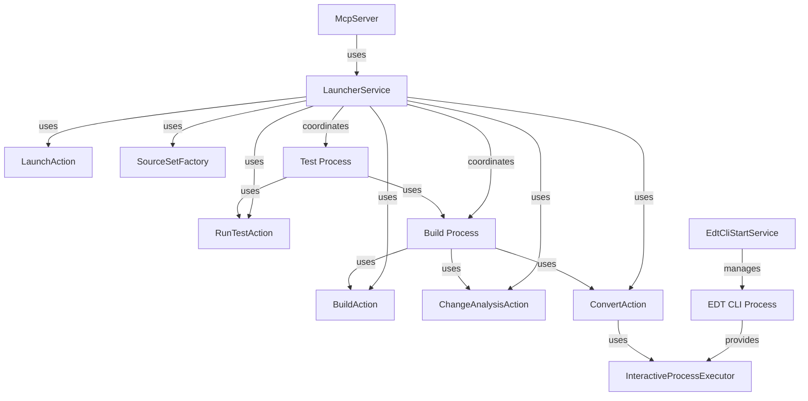

# Пакет `io.github.alkoleft.mcp.application.services`

## Назначение

Пакет `application.services` содержит сервисы прикладного уровня, которые координируют выполнение действий и управляют жизненным циклом процессов. Сервисы являются фасадами для системы действий и обеспечивают высокоуровневую логику выполнения операций.

## Основные компоненты

### LauncherService

**Класс:** `io.github.alkoleft.mcp.application.services.LauncherService`

Основной сервис для выполнения операций запуска тестов, сборки проектов и запуска приложений. Координирует выполнение действий и управляет процессом сборки с учетом изменений в проекте.

#### Основные методы

##### `runTests(request: TestExecutionRequest): RunTestResult`

Запускает тесты YaXUnit. Перед запуском тестов автоматически выполняет сборку проекта (если обнаружены изменения).

**Процесс:**
1. Выполнение сборки проекта
2. Если сборка успешна - запуск тестов
3. Объединение шагов сборки и тестирования в результат

**Параметры:**
- `request` - запрос на выполнение тестов

**Возвращает:** Результат выполнения тестов с объединенными шагами сборки и тестирования

**Исключения:**
- `TestExecutionError` - если сборка не удалась

##### `build(): BuildResult`

Выполняет интеллектуальную сборку проекта с анализом изменений и инкрементальной сборкой только измененных частей.

**Процесс:**
1. Анализ изменений в файловой системе
2. Если изменений нет - возврат результата без сборки
3. Определение затронутых source set
4. Если формат проекта EDT - конвертация измененных source set
5. Обновление информационной базы только для измененных source set
6. Сохранение состояния изменений после успешной сборки

**Возвращает:** Результат сборки проекта

**Исключения:**
- `AnalysisError` - если не удалось распределить изменения по подпроектам

##### `launch(request: LaunchRequest): LaunchResult`

Запускает приложение 1С:Предприятие указанного типа.

**Параметры:**
- `request` - запрос на запуск приложения

**Возвращает:** Результат запуска приложения

#### Внутренние методы

##### `convertSources(changedSourceSets: SourceSet, destination: SourceSet): ConvertResult`

Выполняет конвертацию измененных source set из формата EDT в формат DESIGNER.

**Параметры:**
- `changedSourceSets` - измененные source set для конвертации
- `destination` - целевой source set

**Возвращает:** Результат конвертации

##### `updateIB(changedSourceSets: SourceSet): BuildResult`

Обновляет информационную базу для измененных source set.

**Параметры:**
- `changedSourceSets` - измененные source set для обновления

**Возвращает:** Результат сборки

#### Зависимости

- `BuildAction` - действие для сборки проекта
- `ChangeAnalysisAction` - действие для анализа изменений
- `LaunchAction` - действие для запуска приложений
- `PlatformDsl` - DSL для работы с платформой 1С
- `ReportParser` - парсер отчетов о тестировании
- `YaXUnitRunner` - запускатель тестов YaXUnit
- `ApplicationProperties` - для получения конфигурации проекта
- `SourceSetFactory` - для создания source set

### SourceSetFactory

**Класс:** `io.github.alkoleft.mcp.application.services.SourceSetFactory`

Фабрика для создания source set для различных форматов проектов. Инкапсулирует логику создания source set для форматов EDT и DESIGNER, обеспечивая правильное преобразование путей и структуры проектов.

#### Основные методы

##### `createEdtSourceSet(): SourceSet`

Создает source set для формата EDT на основе конфигурации проекта.

**Возвращает:** Source set для EDT формата или пустой source set, если формат не EDT

##### `createDesignerSourceSet(): SourceSet`

Создает source set для формата DESIGNER. Если формат проекта EDT, создает source set в рабочей директории с преобразованными путями.

**Возвращает:** Source set для DESIGNER формата

#### Зависимости

- `ApplicationProperties` - для получения конфигурации проекта

### EdtCliStartService

**Класс:** `io.github.alkoleft.mcp.application.services.EdtCliStartService`

Сервис для автозапуска 1C:EDT CLI при старте приложения. Запускает 1C:EDT CLI и инициализирует интерактивную сессию для ускорения выполнения команд конвертации.

#### Основные методы

##### `interactiveExecutor(): InteractiveProcessExecutor?`

Получает интерактивный исполнитель EDT CLI. Если процесс не запущен - запускает его и ожидает инициализации. Если идет инициализация - ожидает её завершения.

**Возвращает:** Интерактивный исполнитель или null, если формат проекта не EDT

##### `onApplicationReady()`

Обработчик события готовности приложения. Триггерит автозапуск EDT CLI в фоновом режиме без ожидания, если включен автозапуск.

**Условия автозапуска:**
- Формат проекта должен быть EDT
- Должен быть включен `app.tools.edt-cli.auto-start`

#### Внутренние методы

##### `ensureStarted(): Deferred<InteractiveProcessExecutor?>`

Гарантирует, что процесс EDT CLI запущен или запускается. Возвращает общую задачу инициализации. Реализует single-flight паттерн - только один процесс и одна инициализация одновременно.

**Возвращает:** Задача инициализации процесса

##### `startAndInitialize(): InteractiveProcessExecutor?`

Реальный запуск процесса 1C:EDT CLI и инициализация интерактивного исполнителя.

**Процесс:**
1. Проверка наличия исполняемого файла EDT CLI
2. Создание процесса с параметрами из конфигурации
3. Создание интерактивного исполнителя
4. Инициализация процесса (ожидание готовности)
5. Запуск мониторинга процесса (если включен автозапуск)

**Возвращает:** Интерактивный исполнитель или null при ошибке

##### `launchProcessMonitor(process: Process, interactiveExecutor: InteractiveProcessExecutor)`

Запускает мониторинг процесса 1C:EDT CLI в фоновом режиме. Проверяет работоспособность процесса и перезапускает его при необходимости.

**Параметры:**
- `process` - процесс EDT CLI
- `interactiveExecutor` - интерактивный исполнитель

##### `restartProcess()`

Перезапускает процесс 1C:EDT CLI. Останавливает текущий процесс и запускает новый.

#### Зависимости

- `ApplicationProperties` - для получения конфигурации EDT CLI
- `PlatformUtilities` - для поиска исполняемого файла EDT CLI

#### Особенности

- **Single-flight запуск** - гарантирует, что только один процесс EDT CLI запускается одновременно
- **Автозапуск** - может автоматически запускать EDT CLI при старте приложения
- **Мониторинг** - отслеживает работоспособность процесса и перезапускает при необходимости
- **Интерактивный режим** - использует интерактивный режим для ускорения выполнения команд

## Связи с другими модулями

### Зависимости

- **application.actions** - использует действия для выполнения операций
- **configuration.properties** - использует конфигурацию проекта
- **infrastructure.platform.dsl** - использует для работы с EDT CLI
- **infrastructure.platform.dsl.process** - использует для интерактивного выполнения команд

### Используется в

- **server.McpServer** - использует LauncherService для выполнения операций

## Примеры использования

### Запуск тестов

```kotlin
val launcherService = LauncherService(
    buildAction, 
    changeAnalysisAction, 
    launchAction, 
    platformDsl, 
    reportParser, 
    yaxUnitRunner, 
    properties, 
    sourceSetFactory
)
val request = RunAllTestsRequest()
val result = launcherService.runTests(request)
println("Тесты выполнены: ${result.report?.summary?.totalTests}")
```

### Сборка проекта

```kotlin
val result = launcherService.build()
if (result.success) {
    println("Сборка завершена успешно")
} else {
    println("Ошибки: ${result.errors.joinToString()}")
}
```

### Получение интерактивного исполнителя EDT CLI

```kotlin
val edtService = EdtCliStartService(properties, utilityContext)
val executor = edtService.interactiveExecutor()
if (executor != null) {
    // Использование интерактивного исполнителя
}
```

## Диаграмма взаимодействий



## Примечания

- LauncherService координирует выполнение действий и обеспечивает правильный порядок операций
- Интеллектуальная сборка анализирует изменения и выполняет только необходимые операции
- EdtCliStartService обеспечивает быстрый запуск команд конвертации через интерактивный режим
- Все операции логируются для диагностики и отслеживания прогресса

