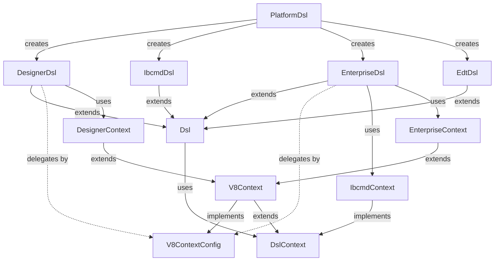

# Пакет `io.github.alkoleft.mcp.infrastructure.platform.dsl`

## Назначение

Пакет `infrastructure.platform.dsl` содержит Domain-Specific Language (DSL) для работы с утилитами платформы 1С:Предприятие. Предоставляет удобный fluent API для выполнения команд конфигуратора, ibcmd, 1С:Предприятие и 1C:EDT CLI.

## Архитектура

DSL построен на основе следующих принципов:
- **Fluent API** - цепочки вызовов для построения команд
- **Немедленное выполнение** - команды выполняются сразу после конфигурации (для DesignerDsl, EnterpriseDsl, EdtDsl)
- **Планирование команд** - для IbcmdDsl команды сначала планируются, затем выполняются
- **Контекст выполнения** - каждый DSL имеет свой контекст с параметрами подключения
- **Делегирование через интерфейсы** - DesignerDsl и EnterpriseDsl используют делегирование Kotlin (`by`) для реализации методов конфигурации из `V8ContextConfig`

## Основные компоненты

### PlatformDsl

**Класс:** `io.github.alkoleft.mcp.infrastructure.platform.dsl.PlatformDsl`

Главный компонент, предоставляющий доступ ко всем под-DSL для работы с платформой 1С.

**Методы:**
- `designer(block: DesignerDsl.() -> Unit): DesignerDsl` - DSL для работы с конфигуратором
- `ibcmd(block: IbcmdDsl.() -> Unit): IbcmdDsl` - DSL для работы с ibcmd
- `enterprise(block: EnterpriseDsl.() -> Unit): EnterpriseDsl` - DSL для работы с 1С:Предприятие (тонкий клиент)
- `enterprise(utilityType: UtilityType, block: EnterpriseDsl.() -> Unit): EnterpriseDsl` - DSL для работы с 1С:Предприятие (с указанием типа)
- `edt(block: EdtDsl.() -> Unit): EdtDsl` - DSL для работы с 1C:EDT CLI

### DesignerDsl

**Класс:** `io.github.alkoleft.mcp.infrastructure.platform.dsl.designer.DesignerDsl`

DSL для работы с конфигуратором 1С. Команды выполняются немедленно после конфигурации.

**Основные команды:**
- `loadCfg` - загрузка конфигурации из файла
- `loadConfigFromFiles` - загрузка конфигурации из файлов
- `updateDBCfg` - обновление конфигурации базы данных
- `checkConfig` - проверка конфигурации
- `checkModules` - проверка модулей
- `dumpConfigToFiles` - выгрузка конфигурации в файлы
- `dumpExtensionToFiles` - выгрузка расширения в файлы
- `applyCfg` - применение конфигурации

**Контекст:** `DesignerContext` - содержит параметры подключения к информационной базе

**Наследование:** Наследуется от `Dsl<DesignerContext, DesignerCommand>`

**Делегирование:** Реализует интерфейс `V8ContextConfig` через делегирование Kotlin (`V8ContextConfig by context`). Все методы конфигурации (connect, user, password и т.д.) автоматически делегируются в `context`, который является экземпляром `DesignerContext` (наследуется от `V8Context`, реализующего `V8ContextConfig`).

### IbcmdDsl

**Класс:** `io.github.alkoleft.mcp.infrastructure.platform.dsl.ibcmd.IbcmdDsl`

DSL для формирования и выполнения команд ibcmd с поддержкой иерархической структуры. Команды сначала планируются, затем выполняются через `buildPlan().execute()`.

**Основные режимы работы:**
- `config` - работа с конфигурацией (импорт, экспорт, применение и т.д.)
- `infobase` - управление информационными базами
- `server` - управление сервером
- `session` - управление сеансами
- `lock` - управление блокировками
- `mobileApp` - экспорт мобильных приложений
- `extension` - управление расширениями

**Контекст:** `IbcmdContext` - содержит параметры подключения к базе данных

### EnterpriseDsl

**Класс:** `io.github.alkoleft.mcp.infrastructure.platform.dsl.enterprise.EnterpriseDsl`

DSL для работы с 1С:Предприятие (тонкий или толстый клиент). Используется для запуска приложений и выполнения команд.

**Основные команды:**
- `launch()` - запуск приложения

**Контекст:** `EnterpriseContext` - содержит параметры подключения и тип утилиты

**Наследование:** Наследуется от `Dsl<EnterpriseContext, Command>`

**Делегирование:** Реализует интерфейс `V8ContextConfig` через делегирование Kotlin (`V8ContextConfig by context`). Все методы конфигурации (connect, user, password и т.д.) автоматически делегируются в `context`, который является экземпляром `EnterpriseContext` (наследуется от `V8Context`, реализующего `V8ContextConfig`).

### EdtDsl

**Класс:** `io.github.alkoleft.mcp.infrastructure.platform.dsl.edt.EdtDsl`

DSL для работы с 1C:EDT CLI. Команды выполняются немедленно. Поддерживает интерактивный режим через `EdtCliExecutor`.

**Основные команды:**
- `version()` - получение версии EDT
- `run(vararg args: String)` - выполнение произвольной команды
- `export(projectName: String, configurationFiles: String): ProcessResult` - экспорт проекта в XML
- И другие команды EDT CLI

**Особенности:**
- Поддерживает интерактивный режим для ускорения выполнения команд
- Команды выполняются через `EdtCliExecutor`

### Базовые классы

#### Dsl

**Класс:** `io.github.alkoleft.mcp.infrastructure.platform.dsl.common.Dsl`

Базовый абстрактный класс для всех DSL. Предоставляет общую функциональность для выполнения команд.

**Методы:**
- `executeCommand(command: C, logPath: Path?): ProcessResult` - выполняет команду
- `buildCommandArgs(command: C, logPath: Path?): List<String>` - строит аргументы команды
- `generateLogFilePath(): Path` - генерирует путь к файлу логов

#### V8ContextConfig

**Интерфейс:** `io.github.alkoleft.mcp.infrastructure.platform.dsl.common.V8ContextConfig`

Интерфейс для конфигурации контекста V8 (платформа 1С). Определяет методы для настройки подключения и параметров выполнения утилит платформы 1С (конфигуратор, предприятие).

**Использование:** Интерфейс реализуется классом `V8Context`, а затем делегируется в `DesignerDsl` и `EnterpriseDsl` через механизм делегирования Kotlin (`by context`). Это позволяет избежать дублирования кода и обеспечивает автоматическое делегирование всех методов конфигурации.

**Методы:**
- `connect(connectionString: String)` - устанавливает строку подключения
- `connectToServer(serverName: String, dbName: String)` - подключается к серверу приложений
- `connectToFile(path: String)` - подключается к файловой БД
- `user(user: String)` - устанавливает имя пользователя
- `password(password: String)` - устанавливает пароль
- `output(path: Path)` - устанавливает путь к файлу вывода
- `language(code: String)` - устанавливает код языка интерфейса
- `localization(code: String)` - устанавливает код локализации
- `disableStartupDialogs()` - отключает стартовые диалоги
- `disableStartupMessages()` - отключает стартовые сообщения
- `noTruncate()` - не очищает файл вывода при записи

#### V8Context

**Класс:** `io.github.alkoleft.mcp.infrastructure.platform.dsl.common.V8Context`

Базовый контекст для работы с утилитами платформы 1С (конфигуратор, предприятие). Реализует интерфейс `V8ContextConfig` и предоставляет базовую функциональность для построения аргументов команд.

**Наследование:** Наследуется от `DslContext`, реализует `V8ContextConfig`

#### DslContext

**Интерфейс:** `io.github.alkoleft.mcp.infrastructure.platform.dsl.common.DslContext`

Базовый интерфейс для контекстов DSL. Определяет метод построения базовых аргументов команды.

**Методы:**
- `buildBaseArgs(): List<String>` - строит базовые аргументы команды

#### PlatformUtilities

**Класс:** `io.github.alkoleft.mcp.infrastructure.platform.dsl.common.PlatformUtilities`

Контекст платформы, содержащий информацию о доступных утилитах и методы для их поиска.

**Методы:**
- `locateUtility(utilityType: UtilityType): UtilityLocation` - находит утилиту указанного типа

## Процесс выполнения команд

### DesignerDsl / EnterpriseDsl

1. Создание экземпляра DSL с контекстом
2. Конфигурация команды через блок (методы из `V8ContextConfig` автоматически делегируются через `by context`)
3. Немедленное выполнение команды
4. Возврат результата выполнения

**Механизм делегирования:**
```kotlin
class DesignerDsl(...) : Dsl<DesignerContext, DesignerCommand>(context),
    V8ContextConfig by context {
    // Все методы V8ContextConfig (connect, user, password и т.д.) 
    // автоматически делегируются в context без явной реализации
}
```

При вызове `dsl.connect("...")` метод автоматически делегируется в `context.connect("...")`, где `context` является экземпляром `DesignerContext` или `EnterpriseContext`.

### IbcmdDsl

1. Создание экземпляра DSL с контекстом
2. Построение плана команд через блоки (config, infobase и т.д.)
3. Вызов `buildPlan()` для создания плана выполнения
4. Вызов `execute()` для выполнения всех команд плана

### EdtDsl

1. Создание экземпляра DSL с контекстом
2. Выполнение команды (немедленно или через интерактивный режим)
3. Возврат результата выполнения

## Примеры использования

### Работа с конфигуратором

```kotlin
platformDsl.designer {
    connect("File='/path/to/db';")
    user("admin")
    password("password")
    disableStartupDialogs()
    
    loadConfigFromFiles {
        fromPath(Path("/path/to/config"))
        updateDBCfg()
    }
}
```

### Работа с ibcmd

```kotlin
platformDsl.ibcmd {
    dbPath = "/path/to/db"
    user = "admin"
    password = "password"
    
    config {
        import(Path("/path/to/config")) {
            extension = "MyExtension"
        }
        apply()
    }
    
    val plan = buildPlan()
    plan.execute()
}
```

### Работа с 1С:Предприятие

```kotlin
platformDsl.enterprise(UtilityType.THIN_CLIENT) {
    connect("File='/path/to/db';")
    user("admin")
    password("password")
    
    val result = launch()
    println("Приложение запущено, PID: ${result.pid}")
}
```

### Работа с EDT CLI

```kotlin
platformDsl.edt {
    val result = export(
        projectName = "MyProject",
        configurationFiles = "/path/to/config"
    )
    println("Экспорт завершен: ${result.success}")
}
```

## Связи с другими модулями

### Зависимости

- **infrastructure.platform.locator** - используется для поиска утилит платформы
- **infrastructure.platform.dsl.process** - используется для выполнения процессов
- **application.core** - использует базовые типы данных

### Используется в

- **application.actions** - использует DSL для выполнения операций сборки, конвертации и запуска
- **application.services** - использует DSL через действия

## Диаграмма иерархии DSL



## Примечания

- Все DSL используют единообразный подход к конфигурации через блоки
- Команды DesignerDsl и EnterpriseDsl выполняются немедленно
- Команды IbcmdDsl планируются и выполняются пакетно
- EdtDsl поддерживает интерактивный режим для ускорения выполнения
- Все команды логируются для диагностики
- Контексты DSL инкапсулируют параметры подключения и настройки выполнения
- **Делегирование через интерфейсы**: `DesignerDsl` и `EnterpriseDsl` используют делегирование Kotlin (`by context`) для реализации `V8ContextConfig`. Это позволяет автоматически делегировать все методы конфигурации (connect, user, password и т.д.) без явной реализации, сокращая количество кода и избегая дублирования.

