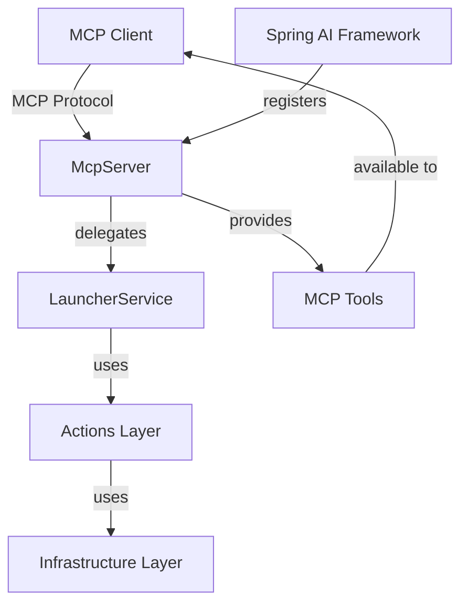

# Пакет `io.github.alkoleft.mcp.server`

## Назначение

Пакет `server` содержит компоненты MCP (Model Context Protocol) сервера, который предоставляет инструменты для работы с тестами YaXUnit и сборкой проектов 1С:Предприятие через протокол MCP. Этот пакет является точкой входа для всех MCP-инструментов, которые могут быть вызваны через AI-ассистентов, поддерживающих протокол MCP.

## Основные компоненты

### McpServer

**Класс:** `io.github.alkoleft.mcp.server.McpServer`

Основной сервис MCP сервера, предоставляющий инструменты для:
- Запуска всех тестов проекта
- Запуска тестов отдельного модуля
- Сборки проекта
- Запуска приложений 1С:Предприятие

#### Основные методы

##### `runAllTests(): McpTestResponse`

Запускает все тесты YaXUnit в проекте. Перед запуском тестов автоматически выполняется анализ изменений и инкрементальная сборка (если обнаружены изменения).

**Процесс выполнения:**
1. Создание запроса на запуск всех тестов
2. Делегирование выполнения в `LauncherService`
3. Преобразование результата в формат MCP-ответа

**Возвращает:** `McpTestResponse` с результатами выполнения тестов

**MCP Tool:** `run_all_tests`

##### `runModuleTests(moduleName: String): McpTestResponse`

Запускает тесты YaXUnit только из указанного модуля. Полезно для фокусного тестирования конкретной функциональности.

**Параметры:**
- `moduleName` - Имя модуля для тестирования (должно соответствовать имени модуля в конфигурации проекта)

**Возвращает:** `McpTestResponse` с результатами выполнения тестов модуля

**MCP Tool:** `run_module_tests`

##### `buildProject(): McpBuildResponse`

Выполняет сборку проекта 1С:Предприятие. Система автоматически определяет, какие модули были изменены, и выполняет инкрементальную сборку только измененных частей проекта.

**Процесс выполнения:**
1. Анализ изменений в исходных файлах
2. Определение затронутых модулей
3. Выполнение сборки (инкрементальной или полной)
4. Измерение времени выполнения

**Возвращает:** `McpBuildResponse` с результатами сборки

**MCP Tool:** `build_project`

##### `launchUtility(utilityType: String): McpLaunchResponse`

Запускает одно из приложений платформы 1С:Предприятие на основе переданного псевдонима.

**Поддерживаемые типы приложений и их псевдонимы:**
- **DESIGNER**: "DESIGNER", "designer", "1cv8", "конфигуратор"
- **THIN_CLIENT**: "THIN_CLIENT", "thin_client", "1cv8c", "тонкий клиент"
- **THICK_CLIENT**: "THICK_CLIENT", "thick_client", "толстый клиент"

**Параметры:**
- `utilityType` - Псевдоним типа приложения для запуска

**Возвращает:** `McpLaunchResponse` с результатом запуска

**MCP Tool:** `launch_app`

#### Зависимости

- `LauncherService` - Сервис для выполнения операций запуска тестов, сборки и запуска приложений

### McpConfiguration

**Класс:** `io.github.alkoleft.mcp.server.McpConfiguration`

Конфигурация Spring для интеграции MCP сервера с Spring AI Framework. Регистрирует `McpServer` как провайдер инструментов (tools) для MCP протокола.

#### Методы

##### `platformTools(platformMcp: McpServer): ToolCallbackProvider`

Создает провайдер инструментов MCP. Регистрирует все методы `McpServer`, помеченные аннотацией `@Tool`, как доступные инструменты для MCP протокола.

**Параметры:**
- `platformMcp` - Экземпляр MCP сервера, содержащий инструменты

**Возвращает:** `ToolCallbackProvider`, который может быть использован Spring AI Framework

## Модели данных

### McpTestResponse

**Класс:** `io.github.alkoleft.mcp.server.McpTestResponse`

Результат выполнения тестов в формате MCP. Содержит полную информацию о результатах выполнения тестов YaXUnit.

**Свойства:**
- `success: Boolean` - Успешность выполнения тестов
- `message: String` - Сообщение о результате выполнения
- `totalTests: Int?` - Общее количество выполненных тестов
- `passedTests: Int?` - Количество успешно пройденных тестов
- `failedTests: Int?` - Количество проваленных тестов
- `executionTime: Long?` - Время выполнения тестов в миллисекундах
- `testDetail: List<GenericTestSuite>?` - Детальная информация о наборах тестов
- `steps: List<ActionStepResult>?` - Список шагов выполнения (заполняется только при ошибках)
- `errors: List<String>` - Список ошибок, возникших во время выполнения
- `enterpriseLogPath: String?` - Путь к логу 1С:Предприятие
- `logFile: String?` - Путь к файлу лога выполнения тестов

### McpBuildResponse

**Класс:** `io.github.alkoleft.mcp.server.McpBuildResponse`

Результат сборки проекта в формате MCP. Содержит информацию о результатах сборки проекта 1С:Предприятие.

**Свойства:**
- `success: Boolean` - Успешность сборки
- `message: String` - Сообщение о результате сборки
- `buildTime: Long?` - Время выполнения сборки в миллисекундах
- `steps: List<ActionStepResult>?` - Список шагов выполнения сборки (заполняется только при ошибках)

### McpLaunchResponse

**Класс:** `io.github.alkoleft.mcp.server.McpLaunchResponse`

Результат запуска приложения в формате MCP. Содержит информацию о результатах запуска приложения 1С:Предприятие.

**Свойства:**
- `success: Boolean` - Успешность запуска
- `message: String` - Сообщение о результате запуска (может содержать PID процесса или описание ошибки)

## Вспомогательные функции

### `RunTestResult.toResponse(): McpTestResponse`

Расширяющая функция для преобразования результата выполнения тестов в формат MCP-ответа. Извлекает статистику тестов, детали выполнения и информацию об ошибках из отчета.

**Параметры:**
- `receiver` - Результат выполнения тестов, полученный от `LauncherService`

**Возвращает:** MCP-ответ с результатами выполнения тестов

## Интеграция с MCP протоколом

MCP сервер интегрируется с Spring AI Framework через аннотацию `@Tool`. Каждый публичный метод `McpServer`, помеченный этой аннотацией, становится доступным как инструмент для MCP-клиентов.

### Доступные MCP инструменты

1. **run_all_tests** - Запуск всех тестов проекта
2. **run_module_tests** - Запуск тестов отдельного модуля
3. **build_project** - Сборка проекта
4. **launch_app** - Запуск приложения 1С:Предприятие

## Связи с другими модулями

### Зависимости

- **application.services.LauncherService** - Используется для выполнения операций запуска тестов, сборки и запуска приложений
- **application.actions.common** - Используются модели данных для результатов действий
- **application.actions.test.yaxunit** - Используются модели данных для тестов YaXUnit

### Используется в

- Spring AI Framework - Для регистрации MCP инструментов
- MCP-клиенты - Для вызова инструментов через протокол MCP

## Примеры использования

### Запуск всех тестов

```kotlin
val mcpServer = McpServer(launcherService)
val result = mcpServer.runAllTests()
println("Тестов выполнено: ${result.totalTests}")
println("Успешно: ${result.passedTests}, Провалено: ${result.failedTests}")
```

### Запуск тестов модуля

```kotlin
val result = mcpServer.runModuleTests("МойМодуль")
if (result.success) {
    println("Все тесты модуля прошли успешно")
} else {
    println("Ошибки: ${result.errors.joinToString()}")
}
```

### Сборка проекта

```kotlin
val result = mcpServer.buildProject()
if (result.success) {
    println("Сборка завершена за ${result.buildTime}ms")
} else {
    println("Ошибка сборки: ${result.message}")
}
```

### Запуск конфигуратора

```kotlin
val result = mcpServer.launchUtility("designer")
if (result.success) {
    println("Конфигуратор запущен: ${result.message}")
}
```

## Диаграмма взаимодействий



## Примечания

- Все методы `McpServer` обрабатывают исключения и возвращают структурированные ответы с информацией об ошибках
- Время выполнения операций измеряется для всех инструментов
- Логирование выполняется на всех этапах выполнения операций
- MCP инструменты автоматически регистрируются Spring AI Framework при старте приложения

